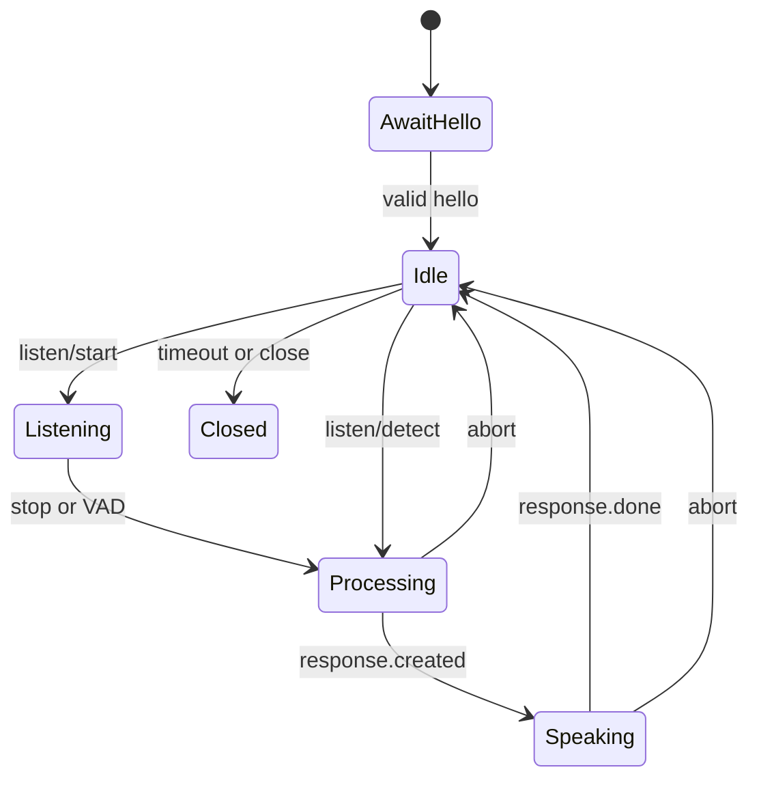

# Frozen wire contract v0.1

This is the deliberately small contract implemented by the gateway. It targets
stock XiaoZhi firmware v2.5.0 and protocol version 1.

## Bootstrap

`GET` or `POST /xiaozhi/ota/` returns only:

```json
{"websocket":{"url":"wss://host/xiaozhi/ws","token":"opaque-token","version":1}}
```

There is no `mqtt`, firmware, MCP, activation, or management response.

## Upgrade and hello

The gateway requires `Authorization: Bearer <token>`, `Protocol-Version: 1`,
`Device-Id`, and `Client-Id` on `GET /xiaozhi/ws`. Within 10 seconds the device
must send:

```json
{"type":"hello","version":1,"transport":"websocket","audio_params":{"format":"opus","sample_rate":16000,"channels":1,"frame_duration":60}}
```

Additional feature fields are ignored. The gateway replies:

```json
{"type":"hello","version":1,"transport":"websocket","session_id":"<uuid>","audio_params":{"format":"opus","sample_rate":24000,"channels":1,"frame_duration":60}}
```

## Device to gateway

| Message | Valid state | Effect |
|---|---|---|
| `listen/start`, mode `auto`, `manual`, or `realtime` | idle/processing/speaking | starts a new turn; interrupts an old one |
| binary frame | listening | one raw 16 kHz mono 60 ms Opus packet (960 decoded samples) |
| `listen/stop` | listening | ends input; manual mode commits explicitly |
| `listen/detect` with text | idle/processing/speaking | submits the text as a user turn |
| `abort` | any established state | cancels input/output and emits one `tts/stop` |

There is no JSON ping. WebSocket control ping/pong is used.

Stock wake-word firmware may send up to a short bounded pre-roll before
`listen/detect`. The gateway accepts at most 50 such packets while idle and
immediately discards them. A `listen/start` arriving within 250 ms of `detect`
coalesces both into a single audio turn; otherwise the detect text is submitted
as a text turn.

## Gateway to device

| Message | Meaning |
|---|---|
| `{"type":"stt","text":"…","session_id":"…"}` | final input transcription |
| `tts/start` | enter speaking state before audio |
| `tts/sentence_start` with text | complete display text for the answer; sent once per response, after the user's `stt` text, and at the latest just before `tts/stop` |
| binary frame | one raw 24 kHz mono 60 ms Opus packet (1440 samples) |
| `tts/stop` | leave speaking state |

All JSON control messages carry the gateway session UUID. Binary frames have no
custom header. Output packets are paced at 60 ms.

## State machine



Limits: 8 KiB JSON, 1275-byte Opus packet, configurable 60-second input turn,
120-second application idle timeout, and 55-minute session lifetime.
