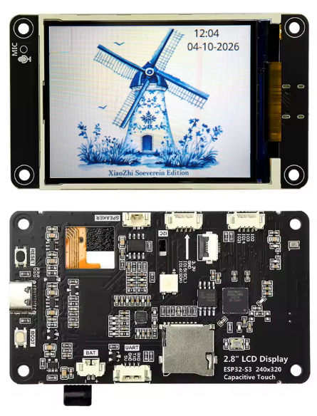
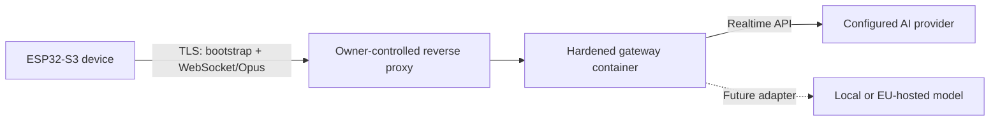

# XiaoZhi Sovereign

**A small, auditable XiaoZhi voice-assistant fork that keeps the device under your control.**

 <p align="center">
     <br>
     <sub>© Original product photo: Freenove, display image edited</sub>
   </p>

XiaoZhi Sovereign combines modified ESP32 firmware with a self-hosted gateway. The device no longer needs the original XiaoZhi cloud path: it obtains its configuration from infrastructure you operate and sends voice traffic only through your gateway.

> Sovereign does not mean “no external processing”. The current gateway uses OpenAI Realtime, so audio, transcripts and prompts required for a conversation are processed by OpenAI currently. Sovereignty here means that this dependency is explicit, replaceable and controlled at a gateway boundary. Local and European provider backends are roadmap items, not current features.

## Why this project exists

Many AI devices make the user interface visible and the data flow invisible. XiaoZhi Sovereign takes the opposite approach:

- the owner chooses the firmware, gateway and AI provider;
- the device is configured through a self-hosted bootstrap endpoint;
- provider credentials remain on the gateway and never reach the ESP32;
- sessions start through a physical button and end automatically;
- the implemented protocol surface is deliberately small;
- data flows, trust boundaries and external processors are documented;
- components can be replaced without replacing the physical device.

The project favours understandable code and explicit boundaries over a large feature set.

## Architecture



The reverse proxy terminates public TLS. The gateway authenticates the device, translates the narrow XiaoZhi WebSocket/Opus protocol and holds provider credentials. The ESP32 never connects directly to an AI provider.

## Repository structure

The repository is intended to contain:

```text
firmware/              Modified XiaoZhi ESP32 firmware
gateway/               Minimal self-hosted protocol gateway
docs/SOVEREIGNTY.md    Definition, trust boundaries and data processing
docs/FIRMWARE.md       Firmware changes and supported hardware
docs/GATEWAY.md        Gateway responsibilities and hardening
LICENSE                Licence and attribution for the firmware fork
GATEWAY_LICENSE        Licence for the independently written gateway
```

## Differences from upstream XiaoZhi

| Area | Upstream/default behaviour | XiaoZhi Sovereign |
|---|---|---|
| Bootstrap and OTA | Upstream-configured service path | Owner-controlled HTTPS endpoint |
| AI connection | Determined by the upstream deployment | Always mediated by the self-hosted gateway |
| Provider secret | Depends on server deployment | Stored only as a gateway secret |
| Session start | Wake word and/or board controls | Explicit BOOT button or active-low GPIO2 button |
| Session lifetime | Deployment-dependent | Closes after a bounded follow-up window |
| Language/UI | General upstream assets and defaults | Dutch build, local windmill idle screen and conversation view |
| Wake word | Supported by upstream | Disabled in the current sovereign build |
| Gateway scope | Full server ecosystem available | Minimal protocol bridge; no OpenClaw dependency |
| Documentation | General-purpose upstream documentation | Explicit data flow, trust boundaries and processors |

This is a focused fork, not a claim that upstream XiaoZhi cannot be self-hosted or adapted in other ways.

## Current status

The project is an early hardware-validated prototype, not a finished consumer product.

Implemented:

- ESP32-S3 firmware for the Freenove 2.8-inch display board used by this project;
- Dutch user interface and local idle artwork;
- self-hosted HTTPS bootstrap and secure WebSocket endpoint;
- Opus audio bridge to OpenAI Realtime;
- device token authentication and optional device-ID restriction;
- physical session control using BOOT or GPIO2-to-GND;
- bounded post-answer listening window;
- hardened, unprivileged Docker deployment on a Synology NAS.

Not yet implemented:

- Mistral or generic provider adapters;
- an operational local-model backend;
- multi-device administration;
- a browser-based management interface;
- independent security audit or production certification.

## Security and privacy position

The design reduces hidden dependencies; it does not eliminate all risk.

- Audio leaves the local network when a cloud AI provider is configured.
- The gateway administrator remains responsible for provider terms, retention settings, lawful processing and user information.
- TLS protects transport, but endpoint compromise remains in scope.
- Physical access to the ESP32 may permit firmware extraction unless hardware security features are configured and verified.
- Logs are intentionally metadata-oriented and must not contain API keys, device tokens, transcripts or raw audio.

See [Sovereignty](docs/SOVEREIGNTY.md) for the complete position.

## Documentation

- [Sovereignty principles and trust boundaries](docs/SOVEREIGNTY.md)
- [Firmware design and upstream differences](docs/FIRMWARE.md)
- [Gateway architecture and hardening](docs/GATEWAY.md)

## Upstream and licences

The firmware is derived from the [XiaoZhi ESP32 project](https://github.com/78/xiaozhi-esp32) and retains upstream attribution. See [`LICENSE`](LICENSE).

The gateway is independently written for this project and is distributed under its own MIT licence. See [`GATEWAY_LICENSE`](GATEWAY_LICENSE).

XiaoZhi Sovereign is an independent project and is not an official XiaoZhi distribution.
