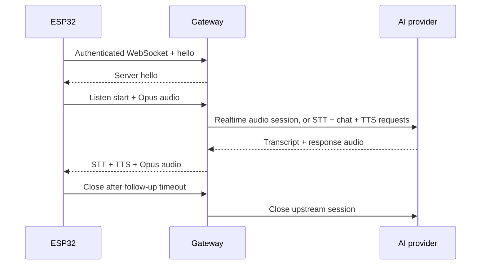

# Gateway

## Purpose

The gateway is a deliberately small protocol boundary between XiaoZhi firmware and an AI backend. It exists so the ESP32 does not need provider credentials, provider-specific protocol logic or a direct relationship with an external cloud.

The gateway bridges XiaoZhi WebSocket/Opus traffic to one of two backends, selected with `BACKEND`: OpenAI Realtime, or Mistral AI (transcription, chat and speech as separate requests).

The alpha source is in [`Docker-Gateway/`](../Docker-Gateway/). It is the complete runnable component, not an OpenClaw plugin or a wrapper around another gateway.

## Responsibilities

The gateway is responsible for:

- serving the bootstrap response used by the device;
- advertising the owner-controlled secure WebSocket URL;
- authenticating the device token;
- optionally restricting access to one device identifier;
- validating JSON messages and protocol state;
- accepting bounded binary Opus packets only while listening;
- decoding, resampling and forwarding audio as required;
- translating transcription and response events back to XiaoZhi messages;
- encoding response audio for the device;
- implementing abort, disconnect and cleanup behaviour;
- closing the upstream AI session when the device disconnects;
- emitting metadata-only operational logs.

It is not intended to be a general AI-agent platform.

## Minimal wire-protocol surface

The implemented surface is intentionally limited to what the device needs:

- client and server `hello`;
- `listen` start, stop and detect states;
- binary Opus audio;
- `stt` transcript messages;
- `tts` start, sentence and stop states;
- abort;
- connection closure and reconnect.

Unsupported messages should fail closed or be ignored only where the protocol explicitly permits that behaviour. Adding unused features increases parsing paths, dependencies and attack surface.

## Request flow

## Provider boundary

The XiaoZhi layer (`protocol.py`) knows no provider. It drives a `ConversationBackend` (`backend.py`) with 16 kHz PCM and turn commands, and receives normalised events: user speech started/ended, user transcript, response started/text/audio/done. Response audio is always 24 kHz PCM.

Two backends implement that contract:

| Backend | How a turn is processed | End of turn decided by |
|---|---|---|
| `openai` (`openai_backend.py`) | one OpenAI Realtime WebSocket session per device session | OpenAI server-side voice activity detection |
| `mistral` (`mistral_backend.py`) | per turn: transcription request, streamed chat completion, streamed speech requests | energy-based silence detection in the gateway (`vad.py`) |

The Mistral backend uses only the Python standard library for HTTP (`http_client.py`), keeps the conversation history in memory for the lifetime of the device session, and enforces a sentence limit on answers. Its setup, tuning and known limits are in [Docker-Gateway/docs/mistral.md](../Docker-Gateway/docs/mistral.md).

A further backend, for example for a locally hosted model, must provide:

- session setup and authentication;
- speech-to-text, or audio input to a speech model;
- conversational model invocation;
- text-to-speech or streamed audio output as 24 kHz PCM;
- cancellation and end-of-turn detection;
- rate, size and timeout limits;
- error reporting without provider payloads.

Provider substitution must preserve the device-facing state machine. OpenClaw is intentionally not a dependency.

## Reference deployment

The tested reference deployment uses:

- Docker Container Manager on a Synology NAS;
- a digest-pinned Docker Hardened Images Python base;
- a multi-stage build;
- non-root user `65532:65532`;
- read-only root filesystem;
- all capabilities dropped;
- `no-new-privileges`;
- bounded memory and temporary filesystem;
- API key and device token mounted as secret files;
- loopback-only published container ports;
- DSM reverse proxy for public TLS and WebSocket upgrade.

The reference is a deployment example, not a universal production baseline.

## Secrets

Provider API keys and device tokens must:

- never be compiled into firmware;
- never be committed to Git;
- never appear in container environment dumps or logs;
- be mounted from protected files or a suitable secret manager;
- have the narrowest available provider permissions;
- be rotatable without reflashing the device.

Repository examples must contain placeholders only.

## Logging

Allowed operational events include gateway ready/stopped, pseudonymous device reference, device connected/disconnected, listening started, response completed and sanitized error category.

Logs should not contain raw audio, transcripts, prompts, model responses, provider API keys, device tokens or full authorization headers.

Even metadata has a retention and access requirement. Production deployments should define retention, rotation, monitoring and incident procedures.

## Failure and abuse controls

The gateway should enforce:

- maximum header and request-body sizes;
- maximum JSON message size and nesting assumptions;
- maximum Opus packet size;
- maximum turn and session duration;
- valid state transitions;
- bounded audio and output queues;
- upstream connection and response timeouts;
- safe cancellation and cleanup;
- no detailed upstream error body returned to an untrusted device.

The public reverse proxy should add connection limits and network-level monitoring where appropriate.

## Deliberate exclusions

The minimal gateway does not need:

- a web administration interface;
- persistent conversation history;
- arbitrary tool execution;
- a plugin marketplace;
- shell or filesystem access for the model;
- message brokers not required by the selected device path;
- OpenClaw or another agent framework.

Features should be added only when a documented requirement outweighs their operational and security cost.
